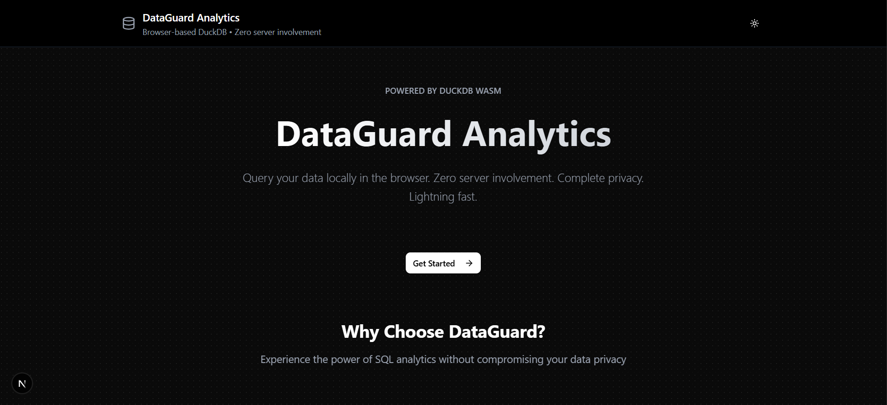

<div align="center">

# 🔒 DataGuard Analytics

```
██████╗  █████╗ ████████╗ █████╗  ██████╗ ██╗   ██╗ █████╗ ██████╗ ██████╗
██╔══██╗██╔══██╗╚══██╔══╝██╔══██╗██╔════╝ ██║   ██║██╔══██╗██╔══██╗██╔══██╗
██║  ██║███████║   ██║   ███████║██║  ███╗██║   ██║███████║██████╔╝██║  ██║
██║  ██║██╔══██║   ██║   ██╔══██║██║   ██║██║   ██║██╔══██║██╔══██╗██║  ██║
██████╔╝██║  ██║   ██║   ██║  ██║╚██████╔╝╚██████╔╝██║  ██║██║  ██║██████╔╝
╚═════╝ ╚═╝  ╚═╝   ╚═╝   ╚═╝  ╚═╝ ╚═════╝  ╚═════╝ ╚═╝  ╚═╝╚═╝  ╚═╝╚═════╝
```

[](https://opensource.org/licenses/MIT)
[](https://www.typescriptlang.org/)
[](https://nextjs.org/)
[](https://duckdb.org/)
[](https://reactjs.org/)

> **🔐 Privacy-First Analytics** 🚀 Query your data locally with complete privacy. Powered by DuckDB WASM. Zero server involvement.

<div align="center">

[](https://dataguard-analytics-xd.vercel.app/)
[](https://github.com/CodewithEvilxd/DataGuard-Analytics)

</div>



---

## 🌟 **Why Choose DataGuard?**

<div align="center">

| 🛡️ **Privacy First** | ⚡ **Lightning Fast** | 🤖 **AI Powered** | 📊 **Rich Analytics** |
|:--------------------:|:--------------------:|:----------------:|:---------------------:|
| Your data never leaves your device | Query millions of rows in milliseconds | Natural language to SQL conversion | Interactive charts & visualizations |
| No servers, no tracking, no compromises | WebAssembly-powered performance | Groq & Ollama integration | Export to multiple formats |

</div>

---

<p align="center">
  <a href="#-features">✨ Features</a> •
  <a href="#-quick-start">🚀 Quick Start</a> •
  <a href="#-usage-guide">📖 Usage</a> •
  <a href="#-api-reference">🔌 API</a> •
  <a href="#-contributing">🤝 Contributing</a>
</p>

<div align="center">
  <strong>👨‍💻 Created by <a href="https://github.com/codewithevilxd">Nishant Gaurav</a></strong>
  <br>
  <a href="https://nishantdev.space">🌐 nishantdev.space</a> •
  <a href="https://github.com/codewithevilxd">💻 GitHub</a> •
  <a href="https://discord.gg/raj.dev_">💬 Discord</a> •
  <a href="https://instagram.com/codewithevilxd">📸 Instagram</a>
</div>

</div>

## 🚀 Features

<div align="center">

### 🔐 **Privacy Shield**
> Your data fortress - completely secure, entirely local

| Feature | Description | Impact |
|:--------|:------------|:-------|
| **🛡️ Zero-Server Architecture** | All processing happens in your browser | 100% data privacy |
| **🔒 No Data Transmission** | Files never leave your device | Complete security |
| **🚫 No Tracking** | No analytics, no logs, no telemetry | Pure privacy |
| **💾 Local Persistence** | Query history stored locally | Your data, your control |

### ⚡ **Performance Engine**
> Lightning-fast analytics powered by cutting-edge technology

```
┌─────────────────────────────────────────────────────────┐
│                    Performance Stack                    │
├─────────────────────────────────────────────────────────┤
│  🦆 DuckDB WASM     │  WebAssembly-powered database     │
│  🚀 In-Memory Ops   │  Millions of rows in milliseconds │
│  💾 Smart Caching   │  Instant results for repeated queries │
│  ⚙️ Optimized Core   │  Near-native performance          │
└─────────────────────────────────────────────────────────┘
```

### 📊 **Analytics Powerhouse**
> Transform your data into insights with professional-grade tools

<div align="center">

#### 🎯 **Core Capabilities**
```
SQL Editor ────► Charts ────► Insights ────► Exports
     │              │            │              │
   Autocomplete   Interactive   Statistics    Multiple
   Templates      Visualizations Profiling    Formats
```

#### 📈 **Visualization Suite**
| Chart Type | Use Case | Features |
|:-----------|:---------|:---------|
| 📊 **Bar Charts** | Compare categories | Stacked, grouped, animated |
| 📈 **Line Charts** | Show trends | Time series, multi-line |
| 🥧 **Pie Charts** | Display proportions | Interactive, labeled |
| 📍 **Scatter Plots** | Find correlations | X-Y relationships |
| 🎯 **Advanced Charts** | Complex analysis | Customizable, multi-axis |

</div>

### 🤖 **AI Intelligence**
> Natural language to SQL - powered by advanced AI models

<div align="center">

```
┌─────────────────┐    ┌─────────────────┐    ┌─────────────────┐
│  Natural        │ => │  AI Processing  │ => │  SQL Query      │
│  Language       │    │  (Groq/Ollama)  │    │  Generation     │
│  "Show sales    │    │                 │    │  SELECT * FROM  │
│   by region"    │    │  🤖 Advanced AI  │    │  sales GROUP BY │
└─────────────────┘    │  Models         │    │  region         │
                       └─────────────────┘    └─────────────────┘
```

**✨ Smart Features:**
- 🧠 **Context-Aware**: Understands your data schema
- 🎯 **Query Optimization**: Generates efficient SQL
- 💡 **Auto-Suggestions**: Intelligent autocomplete
- 🔄 **Multi-Provider**: Groq (cloud) or Ollama (local)

</div>

### 🎨 **Modern Experience**
> Beautiful, intuitive, and powerful user interface

<div align="center">

#### 🌈 **Design Philosophy**
```
🎨 Beautiful UI ────► 🌙 Dark/Light Themes ────► 📱 Responsive
     │                        │                          │
   Radix UI               System Detection           Mobile-First
   Components             Manual Toggle              Touch-Friendly
```

#### ⌨️ **Power User Features**
- **⚡ Command Palette**: `Ctrl+K` for instant actions
- **🎯 Keyboard Shortcuts**: `Ctrl+Enter` to execute
- **📋 Copy/Paste**: Click any cell to copy data
- **🔍 Smart Search**: Filter results instantly
- **📄 Export Magic**: Multiple formats, one click

</div>

</div>

## 🛠️ Technology Stack

- **Frontend**: Next.js 16, React 19, TypeScript
- **Database**: DuckDB WASM (@duckdb/duckdb-wasm)
- **State Management**: Zustand with persistence
- **UI Components**: Radix UI, Tailwind CSS
- **Charts**: Recharts
- **AI Integration**: Groq API, Ollama (optional)
- **Styling**: Tailwind CSS with custom design system

## 📦 Installation

<div align="center">

### 🎯 **System Requirements**
```
┌─────────────────────────────────────────────────────────┐
│                Minimum Requirements                     │
├─────────────────────────────────────────────────────────┤
│  🖥️  OS:         Windows 10+, macOS 10.15+, Linux       │
│  🟢 Node.js:     18.0.0 or higher                       │
│  🌐 Browser:     Chrome 90+, Firefox 90+, Safari 14+    │
│  💾 RAM:         4GB recommended (2GB minimum)          │
│  💽 Storage:     100MB free space                       │
└─────────────────────────────────────────────────────────┘
```

### 🚀 **Quick Start Guide**

<div align="center">

#### ⚡ **One-Click Setup**
```bash
# Clone & Install in one go!
git clone https://github.com/codewithevilxd/dataguard-analytics.git && \
cd dataguard-analytics && \
pnpm install && \
pnpm dev
```

#### 📋 **Step-by-Step Installation**

| Step | Command | Description |
|:-----|:--------|:------------|
| 1 | `git clone https://github.com/codewithevilxd/dataguard-analytics.git` | Download the project |
| 2 | `cd dataguard-analytics` | Enter project directory |
| 3 | `pnpm install` | Install all dependencies |
| 4 | `cp .env.example .env` | Setup environment (optional) |
| 5 | `pnpm dev` | Start development server |

#### 🌐 **Access Your App**
```
🚀 Server running at: http://localhost:3000
🎉 Ready to analyze your data!
```

</div>

### 🔧 **Package Managers**

<div align="center">

| Package Manager | Install Command | Notes |
|:---------------:|:---------------:|:------|
| **pnpm** (Recommended) | `pnpm install` | Fast, efficient, recommended |
| **npm** | `npm install` | Standard, works everywhere |
| **yarn** | `yarn install` | Alternative to npm |

</div>

### ⚙️ **Environment Setup**

```bash
# Copy environment template
cp .env.example .env

# Edit with your API keys (optional)
nano .env  # or your favorite editor
```

**Environment Variables:**
```env
# AI Provider API Keys (optional)
GROQ_API_KEY=your_groq_api_key_here

# Ollama Configuration (optional)
OLLAMA_BASE_URL=http://localhost:11434/api
```

</div>

## 🔧 Configuration

### Environment Variables

Create a `.env` file in the root directory:

```env
# AI Provider API Keys (optional)
GROQ_API_KEY=your_groq_api_key_here

# Ollama Configuration (optional, defaults to localhost)
OLLAMA_BASE_URL=http://localhost:11434/api
```

### AI Integration

DataGuard supports two AI providers:

1. **Groq** (Cloud): Requires API key, fast inference
2. **Ollama** (Local): Run models locally, requires Ollama installation

To use AI features:
1. Set your API key in `.env`
2. Enable AI in the application settings
3. Use the "AI Assistant" tab for query generation

## 📖 Usage Guide

### 🚀 Getting Started

1. **Upload Data**: Click "Get Started" and upload a CSV file
2. **Explore Schema**: View table structure and column types
3. **Write Queries**: Use the SQL editor to query your data
4. **Visualize Results**: Switch between table and chart views
5. **Export Data**: Download results in various formats

### ⌨️ SQL Query Editor

- **Keyboard Shortcuts**:
  - `Ctrl+Enter` (or `Cmd+Enter`): Execute query
  - `Ctrl+K` (or `Cmd+K`): Open command palette
- **Auto-completion**: Start typing table or column names
- **Query History**: Access previous queries from the sidebar
- **Templates**: Use pre-built query templates

#### Example Queries

```sql
-- Preview your data
SELECT * FROM your_table LIMIT 10;

-- Count records
SELECT COUNT(*) as total_records FROM your_table;

-- Group and aggregate
SELECT category, COUNT(*) as count, AVG(price) as avg_price
FROM your_table
GROUP BY category
ORDER BY count DESC;

-- Time-based analysis
SELECT DATE_TRUNC('month', created_at) as month,
       COUNT(*) as records
FROM your_table
GROUP BY month
ORDER BY month;
```

### 📊 Data Visualization

- **Table View**: Sortable, searchable data grid with pagination
- **Chart Types**:
  - 📊 **Bar Chart**: Compare categorical data
  - 📈 **Line Chart**: Show trends over time
  - 🥧 **Pie Chart**: Display proportions
  - 📍 **Scatter Plot**: Analyze relationships
  - 🎯 **Advanced Charts**: Customizable multi-axis charts

### 📤 Export Options

Export query results in multiple formats:
- **CSV**: Comma-separated values for Excel/spreadsheets
- **JSON**: JavaScript Object Notation for APIs
- **JSON Lines**: One JSON object per line for streaming
- **Markdown**: Formatted table for documentation
- **HTML**: Web-ready table for reports

## 🖼️ Screenshots

### Landing Page
*Beautiful landing page with feature highlights*

### Analytics Dashboard
*Real-time performance metrics and query statistics*

### SQL Query Editor
*Full-featured editor with syntax highlighting and autocomplete*

### Data Visualization
*Interactive charts and data exploration tools*

## ⚡ Performance Benchmarks

| Operation | Dataset Size | Time | Notes |
|-----------|-------------|------|-------|
| CSV Upload | 1M rows | ~2s | Client-side processing |
| Simple Query | 1M rows | <100ms | Cached results |
| Complex Aggregation | 1M rows | ~500ms | GROUP BY operations |
| Data Export | 100K rows | ~1s | JSON/CSV generation |

*Benchmarks performed on modern hardware with Chrome 120+*

## 🔌 API Reference

### AI Chat Endpoints

#### POST `/api/chat`
Generate SQL queries using AI assistance.

**Request:**
```json
{
  "messages": [
    {
      "role": "user",
      "content": "Show me sales by region"
    }
  ],
  "tableSchema": {
    "sales": ["id", "amount", "region", "date"]
  }
}
```

**Response:**
```json
{
  "query": "SELECT region, SUM(amount) as total_sales FROM sales GROUP BY region ORDER BY total_sales DESC;",
  "explanation": "This query groups sales by region and calculates total sales for each region."
}
```

#### POST `/api/chat/clear`
Clear chat history.

**Request:** Empty body
**Response:** `{"success": true}`

## ❓ FAQ

### General Questions

**Q: Is my data really private?**
A: Yes! All processing happens in your browser. Your data never leaves your device.

**Q: What file formats are supported?**
A: Currently CSV files. Support for Parquet and JSON is planned.

**Q: Do I need to install anything?**
A: No installation required! Works entirely in your web browser.

**Q: Can I use this offline?**
A: Yes, once loaded. The app works offline after initial page load.

### Technical Questions

**Q: What's the maximum dataset size?**
A: Limited by your browser's memory. Typically 10-100MB depending on your device.

**Q: Which browsers are supported?**
A: Modern browsers with WebAssembly support: Chrome 90+, Firefox 90+, Safari 14+, Edge 90+.

**Q: Can I connect to external databases?**
A: Not currently. DataGuard focuses on local file analysis for privacy.

**Q: Is there a desktop version?**
A: Not yet, but it's planned for future releases.

## 🔧 Troubleshooting

### Common Issues

**Problem: CSV upload fails**
- Check file encoding (UTF-8 recommended)
- Ensure proper CSV format with headers
- Verify file size is under browser limits

**Problem: Queries are slow**
- Try using LIMIT clauses for large datasets
- Check if query results are cached
- Consider data preprocessing

**Problem: AI features not working**
- Verify API keys are set in `.env`
- Check network connectivity for Groq
- Ensure Ollama is running locally

**Problem: Charts not displaying**
- Check if data contains numeric columns
- Verify data types are correct
- Try different chart types

### Debug Mode

Enable debug logging by opening browser console:
```javascript
localStorage.setItem('debug', 'true');
```

## 🗺️ Roadmap

### 🚀 Planned Features

- [ ] **Multi-file support**: Join data from multiple CSV files
- [ ] **Advanced data types**: Support for dates, JSON, arrays
- [ ] **Query sharing**: Export/import query collections
- [ ] **Real-time collaboration**: Share analysis sessions
- [ ] **Plugin system**: Extend functionality with plugins
- [ ] **Desktop app**: Electron-based desktop version
- [ ] **Cloud sync**: Optional encrypted cloud backup

### 🔄 Recent Updates

- ✅ DuckDB WASM integration
- ✅ AI-powered query generation
- ✅ Advanced data visualization
- ✅ Multiple export formats
- ✅ Dark/light theme support
- ✅ Command palette
- ✅ Query caching and history

## 🧪 Development

### Local Development Setup

```bash
# Clone repository
git clone https://github.com/your-username/dataguard-analytics.git
cd dataguard-analytics

# Install dependencies
pnpm install

# Start development server
pnpm dev

# Run linting
pnpm lint

# Build for production
pnpm build
```

### Testing

```bash
# Run unit tests
pnpm test

# Run E2E tests
pnpm test:e2e

# Test AI integration
pnpm test:ai
```

### Code Quality

- **ESLint**: Code linting and formatting
- **TypeScript**: Strict type checking
- **Prettier**: Code formatting
- **Husky**: Git hooks for quality checks

## 🏗️ Project Structure

<div align="center">

### 📂 **What's Inside the Box?**

```
🎁 DataGuard Analytics - Unwrapped!
├── 🚀 app/                          # Next.js Application Core
│   ├── 🔌 api/                      # Backend API Routes
│   │   ├── 💬 chat/                 # AI Chat Endpoints
│   │   └── 🧹 chat/clear/           # Chat History Management
│   ├── 🎨 globals.css               # Global Styling
│   ├── 📱 layout.tsx                # App Layout & Theme
│   └── 🏠 page.tsx                  # Main Application Page
├── ⚛️ components/                   # React Component Library
│   ├── 📊 analytics/                # Analytics Components
│   │   ├── 📈 advanced-chart.tsx    # Advanced Charting Engine
│   │   ├── 🤖 ai-assistant.tsx      # AI Query Assistant
│   │   ├── 📊 analytics.tsx         # Analytics Dashboard
│   │   ├── 🎨 chart-customizer.tsx  # Chart Configuration
│   │   ├── 🔍 data-quality.tsx      # Data Quality Analysis
│   │   ├── 📈 data-stats.tsx        # Data Statistics
│   │   ├── 📁 file-upload.tsx       # File Upload Interface
│   │   ├── 🎯 main-content.tsx      # Main Content Area
│   │   ├── ⚡ performance-monitor.tsx # Performance Tracking
│   │   ├── 🏗️ query-builder.tsx     # Visual Query Builder
│   │   ├── ⌨️ query-editor.tsx      # SQL Query Editor
│   │   ├── 📚 query-history.tsx     # Query History
│   │   ├── 📋 query-results.tsx     # Results Display
│   │   ├── 💾 saved-queries.tsx     # Saved Queries
│   │   ├── 📋 table-schemas.tsx     # Schema Viewer
│   │   └── 📊 table-stats.tsx       # Table Statistics
│   ├── 🏠 landing-page.tsx          # Landing Page
│   ├── ✨ TextPressure.tsx          # Text Animation
│   ├── 🌙 theme-provider.tsx        # Theme Management
│   └── 🎨 ui/                       # UI Component Library
│       ├── 🔘 button.tsx
│       ├── 📄 card.tsx
│       ├── ✨ click-spark.tsx       # Click Animations
│       ├── 📊 column-stats-tooltip.tsx # Column Statistics
│       ├── 🎯 command-palette.tsx   # Command Palette
│       ├── 📋 header.tsx            # App Header
│       ├── ⏳ loading-indicator.tsx # Loading States
│       ├── 🌙 mode-toggle.tsx       # Theme Toggle
│       ├── 📱 sidebar.tsx           # App Sidebar
│       ├── 📑 tabs.tsx              # Tab Components
│       └── ✨ text-pressure.tsx     # Text Effects
├── 🛠️ lib/                          # Core Libraries
│   ├── 💬 chat-store.ts             # Chat State Management
│   ├── 🦆 duckdb.ts                 # DuckDB Integration
│   ├── 🚨 error-handler.ts          # Error Handling
│   ├── 📤 export-utils.ts           # Export Utilities
│   ├── 💾 query-cache.ts            # Query Caching
│   ├── 🏪 store.ts                  # Main State Store
│   ├── 📝 types.ts                  # TypeScript Types
│   └── 🔧 utils.ts                  # Utility Functions
├── 🌐 public/                       # Static Assets
│   ├── 🖼️ og-image.png              # Open Graph Image
│   └── 🎨 [various icons]           # UI Icons
├── ⚙️ [config files]                # Configuration
│   ├── 📦 package.json              # Dependencies
│   ├── ⚙️ next.config.ts            # Next.js Config
│   ├── 🎨 tailwind.config.ts        # Tailwind Config
│   ├── 🔍 eslint.config.mjs         # ESLint Config
│   └── 📝 tsconfig.json             # TypeScript Config
└── 🔐 .env                          # Environment Variables
```

### 🎯 **Architecture Overview**

<div align="center">

```
┌─────────────────────────────────────────────────────────┐
│                    🏗️ Architecture                      │
├─────────────────────────────────────────────────────────┤
│  🌐 Frontend Layer                                       │
│  ├── ⚛️ React 19 + Next.js 16                           │
│  ├── 🎨 Tailwind CSS + Radix UI                         │
│  └── 📊 Recharts                                        │
├─────────────────────────────────────────────────────────┤
│  🧠 Processing Layer                                     │
│  ├── 🦆 DuckDB WASM                                     │
│  ├── 🤖 AI Integration (Groq/Ollama)                   │
│  └── 💾 Query Caching                                    │
├─────────────────────────────────────────────────────────┤
│  💽 Storage Layer                                        │
│  ├── 🗄️ In-Memory Database                              │
│  ├── 💾 Local Storage                                    │
│  └── 📁 File System                                      │
└─────────────────────────────────────────────────────────┘
```

</div>

</div>

## 🎯 Key Components

### Core Analytics Engine
- **DuckDB Integration** (`lib/duckdb.ts`): Handles all database operations
- **Query Execution**: Executes SQL queries with error handling
- **Schema Management**: Extracts and manages table schemas
- **File Upload**: Processes CSV files into DuckDB tables

### State Management
- **Zustand Store** (`lib/store.ts`): Centralized state management
- **Persistent Storage**: Local storage for history and settings
- **Query Statistics**: Tracks performance and usage metrics

### UI Components
- **Query Editor**: Full-featured SQL editor with autocomplete
- **Results Display**: Table and chart visualization
- **File Upload**: Drag-and-drop CSV upload
- **Analytics Dashboard**: Performance metrics and statistics

### AI Integration
- **Chat API** (`app/api/chat/`): Backend for AI interactions
- **Provider Support**: Groq and Ollama integration
- **Query Generation**: Natural language to SQL conversion

## 🔐 Security & Privacy

### Data Handling
- **Client-Side Only**: No server-side data processing
- **WebAssembly**: DuckDB runs in isolated WASM environment
- **No External APIs**: Data never sent to external services
- **Local Storage**: Sensitive data stored locally only

### AI Features
- **Optional Integration**: AI features are completely optional
- **Local Models**: Support for local Ollama models
- **Query Context**: Only query structure sent to AI (no data)

## 🚀 Deployment

### Vercel (Recommended)
1. Push to GitHub
2. Connect to Vercel
3. Deploy automatically

### Other Platforms
- **Netlify**: Static deployment
- **Railway**: Full-stack deployment
- **Docker**: Containerized deployment

## 🤝 Contributing

We welcome contributions! Please see our [Contributing Guide](CONTRIBUTING.md) for detailed information.

### 🚀 Quick Start for Contributors

1. **Fork & Clone**
   ```bash
   git clone https://github.com/codewithevilxd/dataguard-analytics.git
   cd dataguard-analytics
   ```

2. **Set up development environment**
   ```bash
   pnpm install
   cp .env.example .env
   pnpm dev
   ```

3. **Create a feature branch**
   ```bash
   git checkout -b feature/amazing-feature
   ```

4. **Make your changes** and ensure:
   - ✅ Code follows TypeScript best practices
   - ✅ ESLint passes without errors
   - ✅ Tests are added/updated
   - ✅ Documentation is updated

5. **Submit a pull request**
   ```bash
   git push origin feature/amazing-feature
   ```

### 📋 Contribution Guidelines

#### Code Style
- **TypeScript**: Strict mode enabled, no `any` types
- **React**: Functional components with hooks
- **Naming**: PascalCase for components, camelCase for functions
- **Imports**: Group imports (React, third-party, local)

#### Testing
- Unit tests for utilities and hooks
- Integration tests for components
- E2E tests for critical user flows

#### Documentation
- Update README for new features
- Add JSDoc comments for complex functions
- Update TypeScript types as needed

### 🏆 Contributors

<a href="https://github.com/codewithevilxd/dataguard-analytics/graphs/contributors">
  
</a>

## 📄 License

```
MIT License

Copyright (c) 2024 Nishant Gaurav

Permission is hereby granted, free of charge, to any person obtaining a copy
of this software and associated documentation files (the "Software"), to deal
in the Software without restriction, including without limitation the rights
to use, copy, modify, merge, publish, distribute, sublicense, and/or sell
copies of the Software, and to permit persons to whom the Software is
furnished to do so, subject to the following conditions:

The above copyright notice and this permission notice shall be included in all
copies or substantial portions of the Software.

THE SOFTWARE IS PROVIDED "AS IS", WITHOUT WARRANTY OF ANY KIND, EXPRESS OR
IMPLIED, INCLUDING BUT NOT LIMITED TO THE WARRANTIES OF MERCHANTABILITY,
FITNESS FOR A PARTICULAR PURPOSE AND NONINFRINGEMENT. IN NO EVENT SHALL THE
AUTHORS OR COPYRIGHT HOLDERS BE LIABLE FOR ANY CLAIM, DAMAGES OR OTHER
LIABILITY, WHETHER IN AN ACTION OF CONTRACT, TORT OR OTHERWISE, ARISING FROM,
OUT OF OR IN CONNECTION WITH THE SOFTWARE OR THE USE OR OTHER DEALINGS IN THE
SOFTWARE.
```

## 🙏 Acknowledgments

### Core Technologies
- **DuckDB** 🚀 - The fastest analytical database in the world
- **Next.js** ⚡ - The React framework for production
- **React 19** ⚛️ - The library for building user interfaces
- **TypeScript** 📘 - JavaScript with syntax for types

### UI & Design
- **Radix UI** 🎨 - Accessible, unstyled UI components
- **Tailwind CSS** 💨 - A utility-first CSS framework
- **Recharts** 📊 - Composable charting library built on React
- **Lucide React** ✨ - Beautiful & consistent icon toolkit

### AI & ML
- **Groq** 🤖 - Fast AI inference platform
- **Ollama** 🦙 - Run LLMs locally
- **Vercel AI SDK** 🔧 - AI SDK for JavaScript

### Development Tools
- **ESLint** 🔍 - Pluggable JavaScript linter
- **Prettier** 💅 - Opinionated code formatter
- **Zustand** 🐻 - Small, fast state management
- **WebAssembly** ⚙️ - Binary instruction format

### Special Thanks
- **Nishant Gaurav** 👨‍💻 - Project creator and maintainer
- **DuckDB Community** 🌟 - For the amazing WASM port
- **Open Source Community** ❤️ - For making this possible

## 📞 Support & Community

### Get Help
- 📧 **Email**: codewithevilxd@gmail.com
- 💬 **Discord**: [Join our community](https://discord.gg/raj.dev_)
- 🐛 **Issues**: [GitHub Issues](https://github.com/codewithevilxd/dataguard-analytics/issues)
- 💡 **Discussions**: [GitHub Discussions](https://github.com/codewithevilxd/dataguard-analytics/discussions)
- 📖 **Documentation**: This README and [docs/](docs/)

### Stay Updated
- 🌐 **Website**: [nishantdev.space](https://nishantdev.space)
- 📸 **Instagram**: [@codewithevilxd](https://instagram.com/codewithevilxd)
- 🐙 **GitHub**: [@codewithevilxd](https://github.com/codewithevilxd)

---

<div align="center">

## 🎉 **Ready to Transform Your Data?**

<div align="center">

```
╔══════════════════════════════════════════════════════════════╗
║                                                              ║
║   🚀 Ready to experience privacy-first analytics?           ║
║                                                              ║
║   ⭐ Star this repo • 🍴 Fork it • 📝 Contribute             ║
║                                                              ║
║   Your data deserves the best protection! 🛡️                 ║
║                                                              ║
╚══════════════════════════════════════════════════════════════╝
```

</div>

### 🌟 **Show Your Support!**

<p align="center">
  <a href="https://github.com/codewithevilxd/dataguard-analytics">
    
  </a>
  <a href="https://github.com/codewithevilxd/dataguard-analytics/fork">
    
  </a>
  <a href="https://github.com/codewithevilxd/dataguard-analytics/issues">
    
  </a>
  <a href="https://github.com/codewithevilxd/dataguard-analytics/blob/main/LICENSE">
    
  </a>
</p>

### 💝 **Built with Love**

<div align="center">

**Crafted with ❤️ by [Nishant Gaurav](https://github.com/codewithevilxd)**

*For data privacy, analytical excellence, and the open-source community*

---

### 🌈 **Connect With Me**

<p align="center">
  <a href="https://nishantdev.space">
    
  </a>
  <a href="https://github.com/codewithevilxd">
    
  </a>
  <a href="https://discord.gg/raj.dev_">
    
  </a>
  <a href="https://instagram.com/codewithevilxd">
    
  </a>
  <a href="mailto:codewithevilxd@gmail.com">
    
  </a>
</p>

---

<div align="center">

# 🎊 **Thank You for Exploring DataGuard Analytics!**

```
╔══════════════════════════════════════════════════════════════╗
║                                                              ║
║   🔒 Zero servers • 🛡️ Complete privacy • ⚡ Lightning fast  ║
║                                                              ║
║   Your data's fortress is ready! 🏰                         ║
║                                                              ║
╚══════════════════════════════════════════════════════════════╝
```

**⭐ Don't forget to star this repository if you found it useful!**

*Made with ❤️ in India 🇮🇳*

</div>

</div>